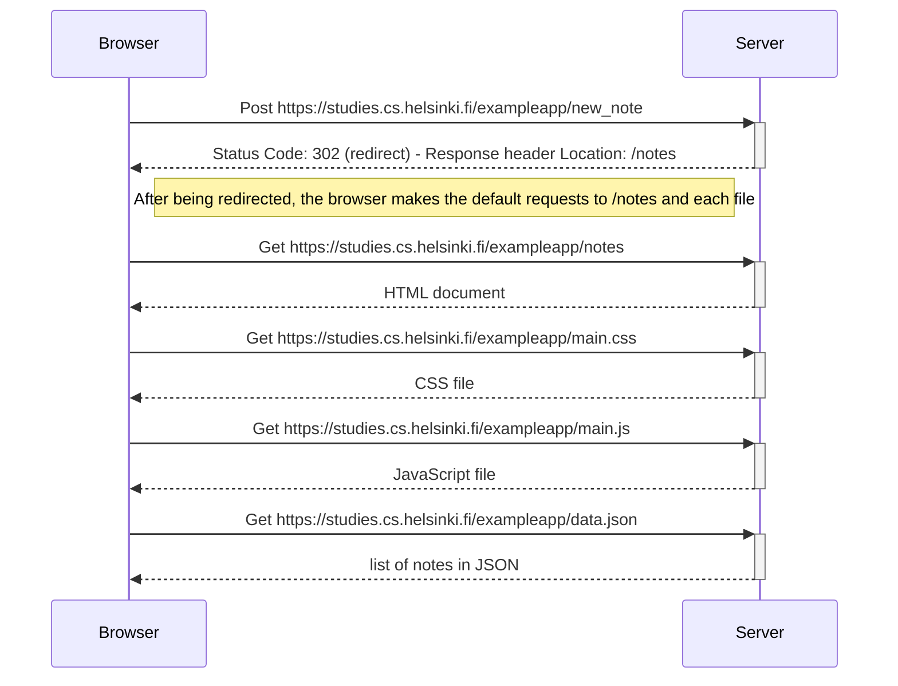

```mermaid
sequenceDiagram
    participant Browser
    participant Server
    Browser->>+Server: Post https://studies.cs.helsinki.fi/exampleapp/new_note
    Server-->>-Browser: Status Code: 302 (redirect) - Response header Location: /notes
    Note right of Browser: After being redirected, the browser makes the default requests to /notes and each file
    Browser->>+Server: Get https://studies.cs.helsinki.fi/exampleapp/notes
    Server-->>-Browser: HTML document
    Browser->>+Server: Get https://studies.cs.helsinki.fi/exampleapp/main.css
    Server-->>-Browser: CSS file
    Browser->>+Server: Get https://studies.cs.helsinki.fi/exampleapp/main.js
    Server-->>-Browser: JavaScript file
    Browser->>+Server: Get https://studies.cs.helsinki.fi/exampleapp/data.json
    Server-->>-Browser: list of notes in JSON
```
