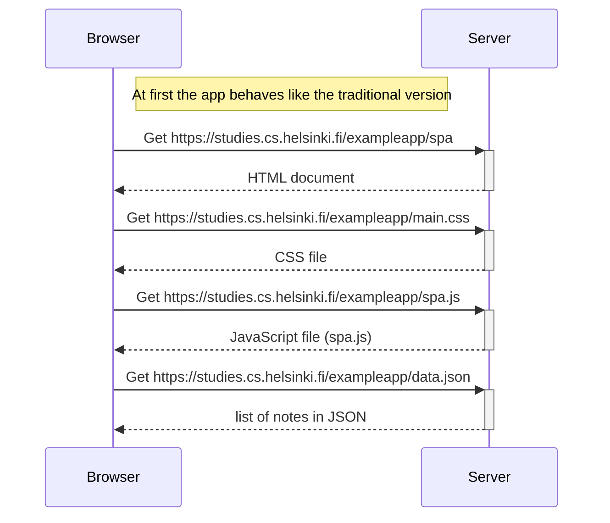

```mermaid
sequenceDiagram
    participant Browser
    participant Server
    Note right of Browser: At first the app behaves like the traditional version
    Browser->>+Server: Get https://studies.cs.helsinki.fi/exampleapp/spa
    Server-->>-Browser: HTML document
    Browser->>+Server: Get https://studies.cs.helsinki.fi/exampleapp/main.css
    Server-->>-Browser: CSS file
    Browser->>+Server: Get https://studies.cs.helsinki.fi/exampleapp/spa.js
    Server-->>-Browser: JavaScript file (spa.js)
    Browser->>+Server: Get https://studies.cs.helsinki.fi/exampleapp/data.json
    Server-->>-Browser: list of notes in JSON
```
